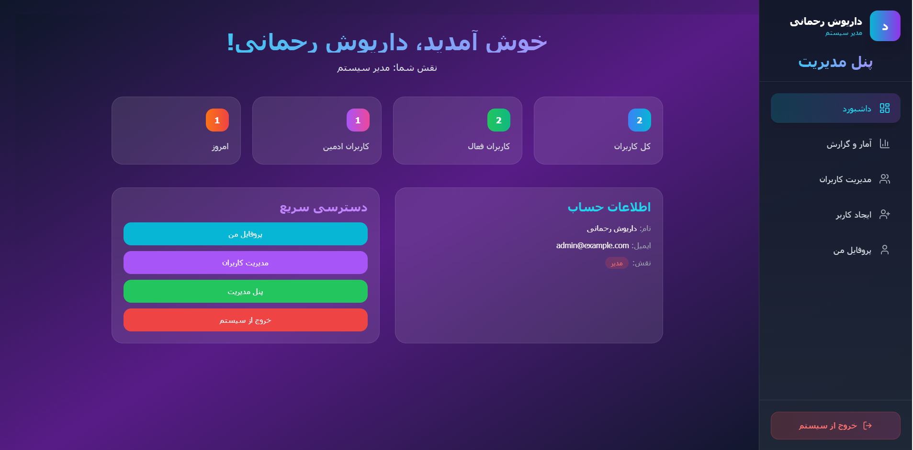
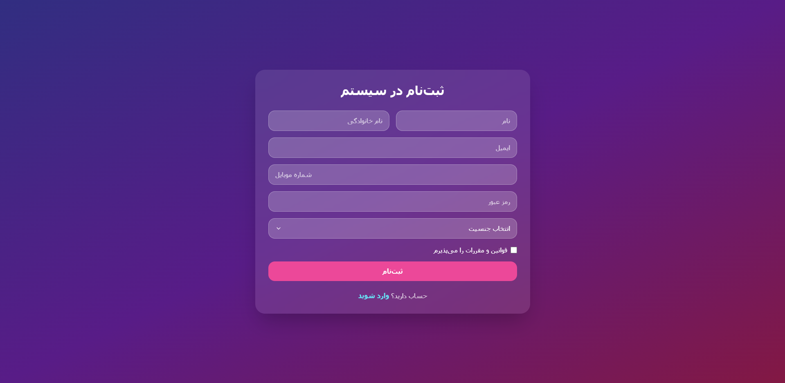

# سیستم مدیریت کاربران حرفه‌ای  
**Full-Stack MERN + Tailwind CSS + JWT + Toast + CRUD کامل**

یک پروژه تمام‌عیار، تمیز، بدون باگ و **کاملاً آماده ارائه در مصاحبه شغلی، فریلنسینگ، رزومه و حتی پروداکشن** با رابط کاربری مدرن و خیره‌کننده.

<p align="center">
  
</p>
<p align="center">
  
</p>

---

## ویژگی‌های کلیدی (همه فعال و تست‌شده)

| قابلیت                          | وضعیت | توضیحات                                                                 |
|----------------------------------|-------|-------------------------------------------------------------------------|
| ورود اجباری با ۳ فیلد            | فعال  | ایمیل + موبایل + رمز عبور (همه الزامی)                                   |
| ثبت‌نام امن و کامل               | فعال  | اعتبارسنجی دقیق + هش رمز عبور با bcrypt                                 |
| نقش‌بندی هوشمند                  | فعال  | `admin@example.com` → خودکار ادمین                                       |
| پنل ادمین کامل (CRUD)            | فعال  | ایجاد، مشاهده، ویرایش، حذف کاربران                                        |
| ایجاد کاربر جدید                 | فعال  | فرم حرفه‌ای + Toast موفقیت                                              |
| ویرایش کاربر                     | فعال  | بارگذاری خودکار اطلاعات + ذخیره تغییرات                                 |
| حذف کاربر با تأیید زیبا           | فعال  | Toast سفارشی (بدون confirm زشت)                                        |
| پیام‌های خطا و موفقیت            | فعال  | react-hot-toast (زیبا و ریسپانسیو)                                      |
| سایدبار هوشمند                  | فعال  | فقط بعد از ورود + کاملاً ریسپانسیو (موبایل عالی)                       |
| محافظت از مسیرها                 | فعال  | ProtectedRoute + AdminRoute                                              |
| احراز هویت امن                   | فعال  | JWT + HttpOnly Cookie + Refresh در آینده قابل اضافه شدن                 |
| رابط کاربری فوق‌العاده           | فعال  | Glassmorphism + Gradient + انیمیشن‌های نرم                             |
| خطای OverwriteModelError         | رفع شده | با `mongoose.models.Member || mongoose.model(...)`                     |
| بدون alert/confirm               | فعال  | همه چیز با Toast حرفه‌ای                                               |

---

## اطلاعات ورود آماده

| نقش       | ایمیل                     | موبایل         | رمز عبور |
|-----------|---------------------------|----------------|----------|
| ادمین     | `admin@example.com`       | `09123456789`  | `123456` |
| کاربر عادی | `user@example.com`      | `09351234567`  | `123456` |

> فقط یک بار با ایمیل `admin@example.com` ثبت‌نام کنید → برای همیشه ادمین می‌مانید

---

## تکنولوژی‌های استفاده‌شده

### Frontend
- React 18 + Vite
- React Router v6
- Tailwind CSS 3
- Formik + Yup
- Axios + Interceptors
- react-hot-toast
- Lucide React Icons

### Backend
- Node.js + Express
- MongoDB + Mongoose
- JWT Authentication
- Bcryptjs
- Cookie-based Auth (HttpOnly)
- CORS + dotenv


## راه‌اندازی پروژه (کمتر از ۲ دقیقه)

```bash
# کلون کردن
git clone https://github.com/yourname/user-management-pro.git
cd user-management-pro

# بک‌اند
cd backend
npm install
npm run dev    # http://localhost:5000

# فرانت‌اند (ترمینال جدید)
cd ../frontend
npm install
npm install react-hot-toast
npm run dev    # http://localhost:5173


.env
PORT=5000
MONGO_URI=mongodb://127.0.1:27017/user-management
JWT_SECRET=your_very_strong_secret_key_2025
NODE_ENV=development

---
توسعه‌دهنده

نام: Dariush Rahmani
نقش: Full-Stack Developer (MERN)